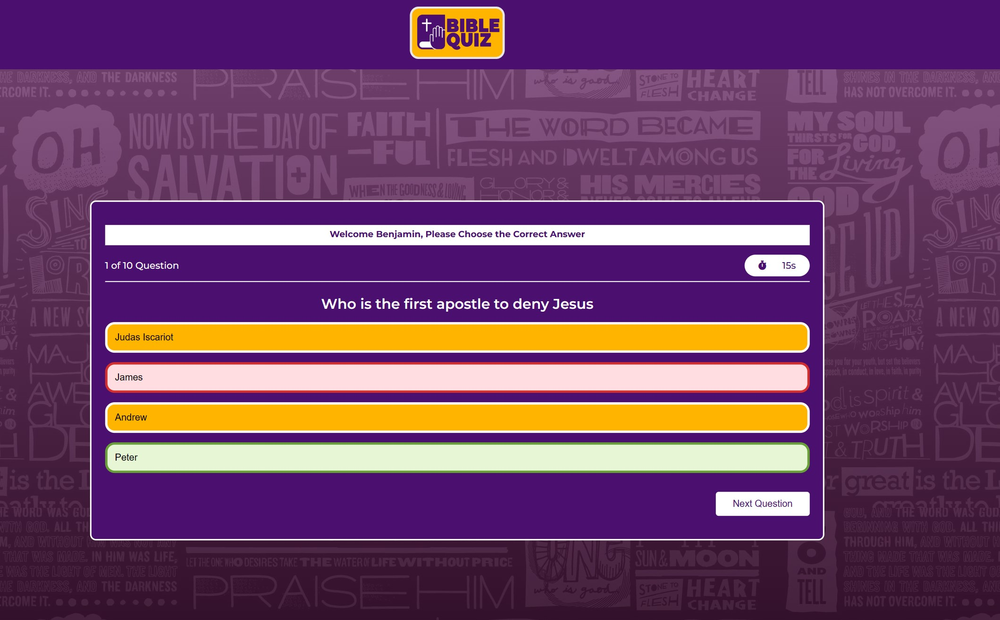
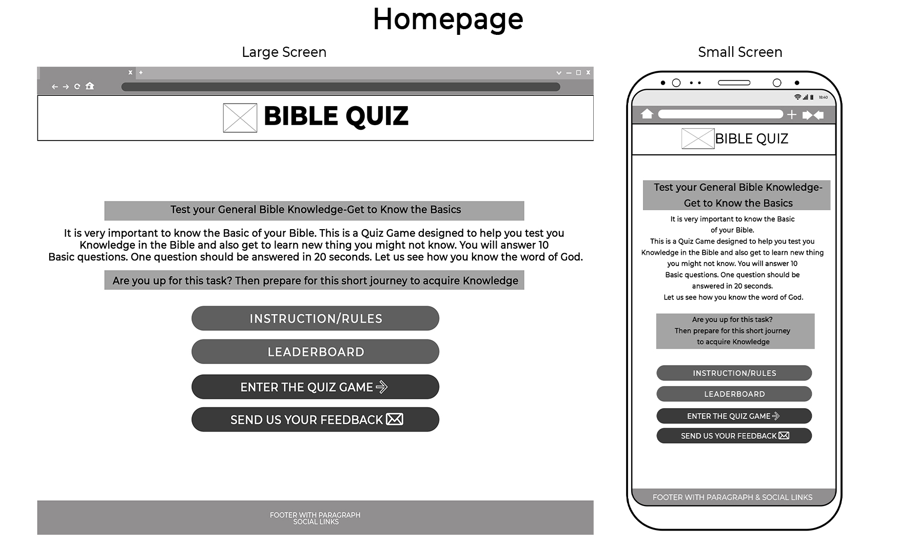
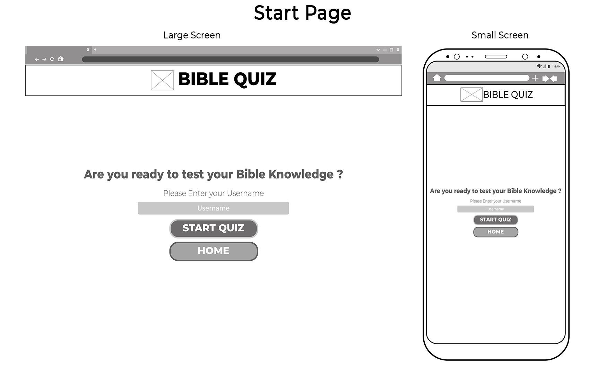
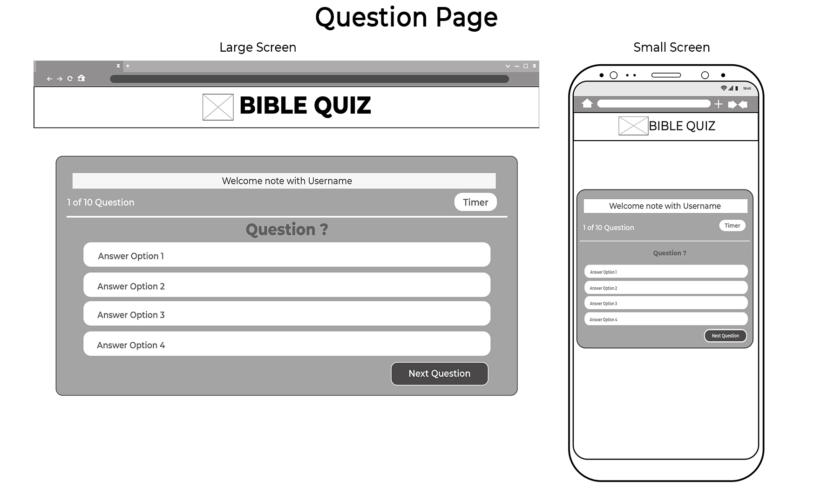
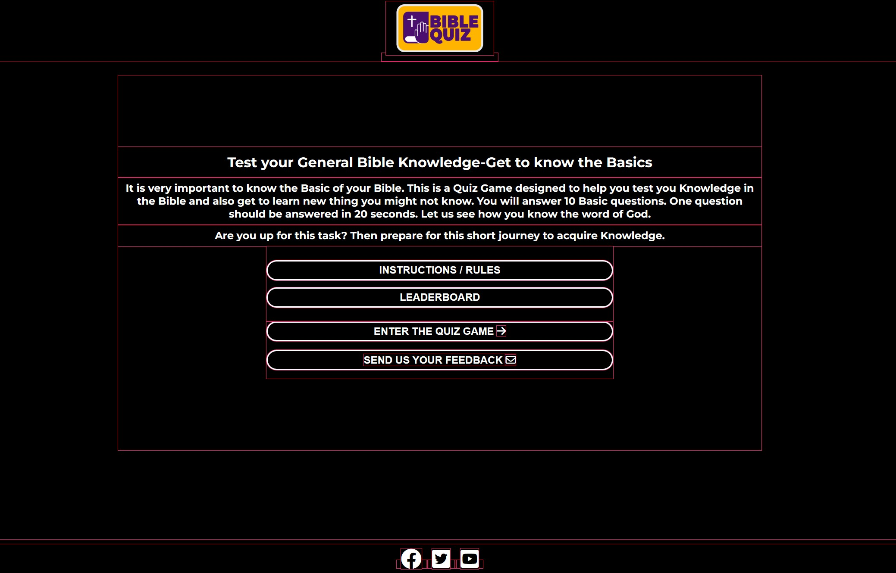
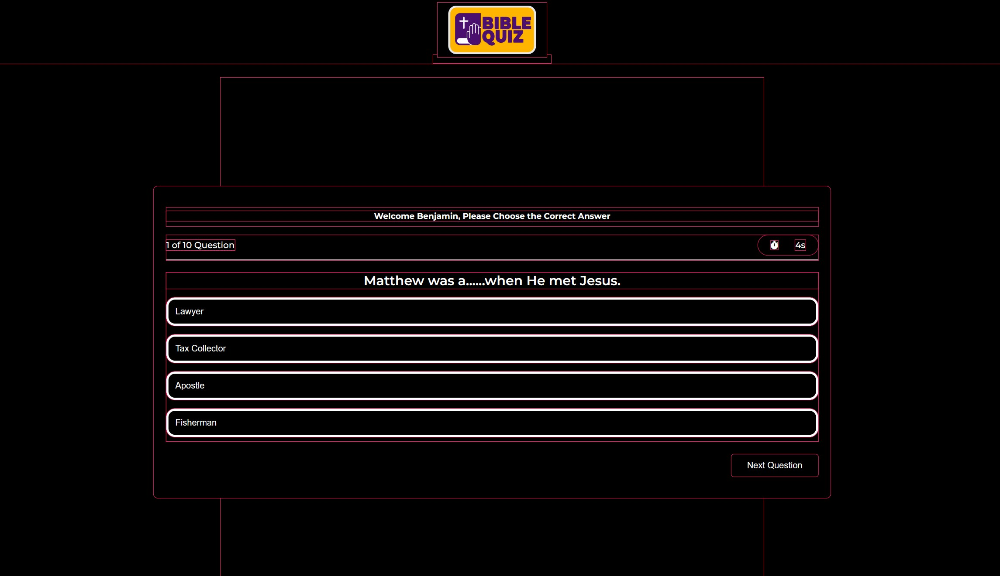

# YA Bible Quiz Game
## A Social Club for the Youth in the Stolberg City and around

YA Bible Quiz project is a quiz game project for the YA ministry in Gospelhaus Church to help build the bible knowledge of the members as they also entertain themselves. Eventhough they are the main target, it is also for everyone who wants to test their basic Bible knowledge.
View the live site [here](https://benohene.github.io/ya-bible-quiz-project/)


#  Table of content
- [FEATURES](#features)
- [DESIGN](#design)
- [TECHNOLOGIES](#technologies-applied)
- [TESTING](#testing)
- [DEPLOYMENT](#deployment)
- [CREDIT](#creditacknowledgement)

# FEATURES

## Home Page

### Title with Favicon
* A favicon will be implemented with the game logo as an identity.
* This will provide an image in the tab's title header to allow users to easily identify the website if they have multiple open tabs.


### Header with Logo
* This is a header with a logo of the webpage.
* The Logo has a link to the homepage to which user can navigate directly back to Homepage from any page.


### Main Content of the game
* This section contains a general information about the website.
* this section also highlight on what user should expect from the website.
* <strong>INSTRUCTION BUTTON</strong> User can click on the this button to access a POP-UP window for instructions to the quiz.
* <strong>ENTER THE QUIZ BUTTON</strong> user can click on this button to access navigate to the start screen of the quiz.


### Instruction Pop-Up Window
* As the <strong>INSTRUCTION BUTTON</strong> is click, this window will pop up showing the instruction of the quiz game.


### Footer
* The Footer section of the page includes a heading that directs visitors to our social media links.
* The footer runs across all the pages and is also responsive to all device sizes


### Start Screen
* This is the introduction page to enter the Quiz game page.
* User must click on <stong>ENTER QUIZ BUTTON</strong> to display the quiz question.


### Quiz Dispalay Screen
* <strong>Question Count</strong> This part of the section displays the question count as user continue with answering the quiz question.
* <strong>Timer</strong> this is the timeout to let user know how many seconds left to answer question.
* <strong>Main Question content</strong> The main question area display the question and 4 options to answer.
* <strong>Next Button</strong> The next button will skip the user to the next question after answering or without answer.


### Correct Answer
* When the user choose the right answer, it gives a green color feedback on the option.


### Wrong Answer
* When the user choose the wrong answer, it gives a red color feedback on the option choosen and green on the correct answer.


### Score and Play Again Page
* This page displays the score after all question has been answered correctly or not.
* The <strong>PLAY AGAIN BUTTON</strong> allow users to restart the quiz game again or click on the LOGO to return to the homepage.


## FUTURE FEATURES
In the future, a username form will be create to allow users to enter their details and store them on a leaderboard. This will be more entertaining to let user challenge themselves.


# DESIGN
## Wireframe

### Homepage


### Instruction Pop Up


### Start Screen 


### Quiz Display Screen


### Play Again


# TECHNOLOGIES APPLIED

* HTML - The structure of the Homepage and Quiz game page were developed using HTML as the main language.

* CSS - The Homepage and Quiz game page were styled using custom CSS in an external file.

* Javasript - This was used to make buttons and the Quiz game interative with the user.

* GitHub - The source code is hosted on GitHub and deployed using Git Pages.

* Git - Used to commit and push code during the development of the Website

* Font Awesome - Provides icons used to structures and give details in HTML https://fontawesome.com/ 

* Photoshop - Used to create wireframes and also edit pictures and logo

# TESTING
## Structure and Styling
During testing, the Unicorn Revealer and Wave were used to check for structure and styling error and all were fixed accordingly. All pages were run by the Unicorn revealer and Wave to fix errors.

### Unicorn revealer
<strong>Homepage</strong>


<strong>Quiz Display Page</strong>


### Wave Web Accessibility


* The Wave Web Accessibility help to make sure that all the necessary HTML attributes are used well without errors.

* It was also used to check for color contrast.


## Responsiveness
The Website has been tested and it passed responsiveness for small mediumum and large screens of various devices. All pages have been tested for with a device size of from 320px.

The Responsive design was tested manually with [Chrome DevTools](https://developer.chrome.com/docs/devtools/) and also the Microsoft Dev tools. The Website worked perfectly well.

The Website pass its responsiveness and no responsive issues were seen on the following trial device:
* iPhone SE
* iPhone 12 Pro
* Samsung Galaxy S20/S20 Ultra
* Surface Duo

The Website was also tested on [Media Genesis Responsive Checker](https://www.responsivedesignchecker.com/) on various device and the expected result was acheived.

## Coding
The website has been thoroughly tested. All the code has been run through the W3C HTML Validator, W3C CSS Validator and the JS Hint. Some errors were initially detected and fixed.

### Homepage HTML


### Homepage CSS


### Homepage JAVASCRIPT


### Quiz HTML
* With Bugs


* Without bugs


### Quiz CSS


### Quiz JAVASCRIPT
* These bugs were detected but they did not have any functionality lags on the page.


## Lighthouse Test

The site was also tested using the lighthouse option built in Dev Tools in Chrome. It was used to check the following features:

* Performance - How the page performs whilst loading on the browser
* Accessibility - Is the site acccessible for all users and how can it be improved.
* Best Practices - Site conforms to industry best practices.
* SEO - Search engine optimization. Is the site optimized for search engine result rankings.

The result was quiet good. The testing was done one all the pages both on desktop and mobile devices. Below are some sample screenshot;

### Lighthouse check on all pages gave a similar result


# DEPLOYMENT
The site was created using the Gitpod and pushed to github to the remote repository.

***Gitpod is an open source developer platform automating the provisioning of ready-to-code developer environments.***

The following git commands were used throughout development to push code to the remote repo:

```git add .``` - This command was used to add all updated file(s) to the staging area.

```git commit -m “commit message”``` - This command was used to commit changes from the staging area to the local repository queue ready for the final step.

```git push``` - This command was used to push all committed code to the remote repository on Git Hub so it is safe and secure.

### Deployment to GitHub Pages

The site was deployed to GitHub pages. The steps to deploy are as follows: 
1. In the GitHub repository, navigate to the Settings tab 

2. From the menu on left select 'Pages'

3. From the source section drop-down menu, select the Branch: main

4. Click 'Save'

5. A live link will be displayed in blue when published successfully.


The Live link can be access by clicking on the blue link here [YA Bible QUiz for All](https://benohene.github.io/ya-bible-quiz-project/)

## Clone the Repository Code Locally
* Navigate to the GitHub Repository you want to clone to use locally:

1. Click on the code drop down button

2. Click on HTTPS

3. Copy the repository link to the clipboard

4. Open your IDE of choice (git must be installed for the next steps)

5. Type git clone copied-git-url into the IDE terminal

***The project will now of been cloned on your local machine for use.***

# CREDIT/ACKNOWLEDGEMENT

## Acknowledge-Code
* Most of the JS code was extracted from a you tube video and manipulated. This is the link [Coding Artist](https://www.youtube.com/watch?v=p-2G-7vLuV4&t=2286s)

## Content
* [Font Awesome](https://fontawesome.com/). Used for icons.
* [Google Fonts](https://fonts.google.com/) Used for fonts.
* [YouTube](http://youtube.com/)The coding of the contact page forms was inspired by a video on Youtube.

## Media
* All images from [Pexels](https://www.pexels.com/).
* Logo was created by me using photoshop.
* Most of the images were edited by me with photoshop.