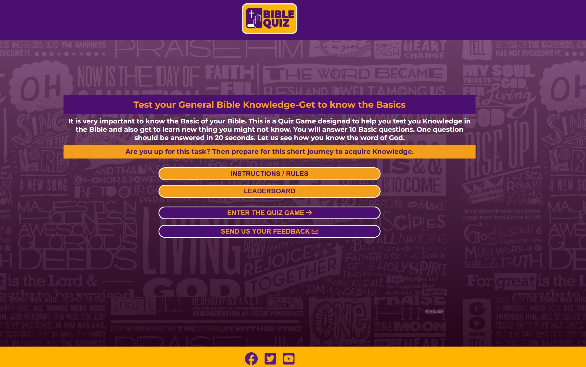

# YA Bible Quiz Game
## A Social Club for the Youth in the Stolberg City and around

YA Bible Quiz project is a quiz game project for the YA ministry in Gospelhaus Church to help build the bible knowledge of the members as they also entertain themselves. Eventhough they are the main target, it is also for everyone who wants to test their basic Bible knowledge.
View the live site [here](https://benohene.github.io/ya-bible-quiz-project/)

# FEATURES

## Home Page

### Title with Favicon
* A favicon will be implemented with the game logo as an identity
* This will provide an image in the tab's title header to allow users to easily identify the website if they have multiple open tabs.

### Header with Logo
* This is a header with a logo of the webpage
* The Logo has a link to the homepage to which user can navigate directly back to Homepage from any page.

### Main Content of the game
* This section contains a general information about the website
* this section also highlight on what user should expect from the website

